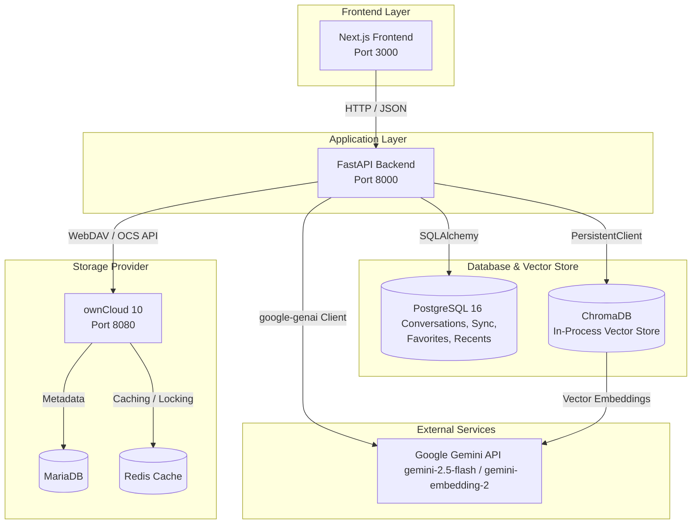

# Nexus — AI-Powered Document Management Platform

Nexus is an intelligent, secure document management platform that integrates **ownCloud** file storage with a **Google Gemini**-powered RAG (Retrieval-Augmented Generation) pipeline. Users can browse, upload, and organize files through a modern web dashboard, get automatic AI-generated summaries, key takeaways, and tags for their files, and ask natural-language questions about their documents to receive precise AI answers with source citations.

---

## Key Features

- **ownCloud Storage Integration**: Seamless file browsing, folder creation, uploads, downloads, and deletion powered by ownCloud WebDAV and OCS Provisioning APIs.
- **Multimodal AI Chat & Q&A**: Ask natural-language questions about document content, with responses citing specific files (e.g., `(Source: /path/to/file.pdf)`). Supports uploading images to analyze visual content alongside documents.
- **AI Document Insights**: Automatically extracts high-level summaries, key bulleted takeaways, and relevant categorizing tags for indexed documents.
- **Semantic Vector Search**: Instantly query document contents by meaning rather than exact keywords. Powered by ChromaDB similarity queries.
- **Project Workspaces**: Collaborate within project environments mapped directly to ownCloud groups and shared directories.
- **User Favorites & Recents**: Fast access to key materials using dedicated dashboard views tracking recent interactions and marked favorites.
- **Admin Control Panel**: Control console for managing users, groups, shared drives, indexing status of all storage documents, and testing the vector database search directly.

---

## Tech Stack

| Layer | Technology |
|---|---|
| **Frontend** | Next.js 16.2, React 19.2, TypeScript, Tailwind CSS 4, shadcn/ui, Base UI |
| **Backend** | FastAPI (Python 3.12), SQLAlchemy 2, Alembic |
| **Storage** | ownCloud 10 (WebDAV + OCS Provisioning API) |
| **AI / RAG** | Google Gemini (via `google-genai` SDK: `gemini-2.5-flash` & `gemini-embedding-2`), ChromaDB (In-Process Vector Store) |
| **Database** | PostgreSQL 16 (for chat sessions, sync registry, favorites, recents, and projects) |
| **Auth** | JWT (python-jose) + Fernet-encrypted ownCloud credentials |
| **Infra** | Docker Compose (Next.js, FastAPI, PostgreSQL, ownCloud, MariaDB, Redis) |

---

## Architecture

Nexus delegates user authentication, user management, and file storage to an ownCloud instance. The FastAPI backend serves as an orchestrator that bridges the Next.js frontend, ownCloud APIs, PostgreSQL metadata database, ChromaDB vector database, and Google Gemini API.

### Flow Diagram

```
                                   ┌──────────────────────┐
                                   │   Next.js Frontend   │
                                   │     (Port 3000)      │
                                   └──────────┬───────────┘
                                              │ (HTTP / JSON)
                                              ▼
                                   ┌──────────────────────┐
                                   │   FastAPI Backend    │
                                   │     (Port 8000)      │
                                   └────┬───┬────────┬────┘
                                        │   │        │
                   ┌────────────────────┘   │        └─────────────────────┐
                   ▼ (SQLAlchemy)           │ (WebDAV / OCS)               ▼
        ┌─────────────────────┐             │                   ┌────────────────────┐
        │    PostgreSQL 16    │             │                   │    ownCloud 10     │
        │ (conversations,     │             │                   │    (Port 8080)     │
        │  sync status,       │             │                   └─────────┬──────────┘
        │  favorites, recents)│             │                             │
        └─────────────────────┘             ▼                             │
                                  ┌───────────────────┐                   ├──────────────────┐
                                  │  ChromaDB (Local) │                   ▼                  ▼
                                  │  (Vector Store)   │              ┌───────────┐     ┌───────────┐
                                  └─────────┬─────────┘              │  MariaDB  │     │   Redis   │
                                            │                        │ (ownCloud)│     │  (Cache)  │
                                            │ (Embeddings)           └───────────┘     └───────────┘
                                            ▼
                                  ┌───────────────────┐
                                  │ Google Gemini API │
                                  │ (Embeddings & Q&A)│
                                  └───────────────────┘
```

### Mermaid Diagram



---

## Project Structure

```
pfa2a/
├── nexus/                      # Next.js Frontend App
│   ├── app/                    # App Router Pages
│   │   ├── admin/              # Admin-specific routes
│   │   │   ├── dashboard/      # Admin dashboard overview
│   │   │   ├── users/          # OCS User administration
│   │   │   ├── groups/         # OCS Group administration
│   │   │   ├── drives/         # ownCloud status metrics
│   │   │   ├── files/          # Vector indexing controls
│   │   │   └── vector-search/  # Similarity query sandbox
│   │   ├── dashboard/          # User dashboard routes
│   │   │   ├── chat/           # Multimodal AI Chat / Q&A
│   │   │   ├── chat-history/   # Active/past session archives
│   │   │   ├── file-info/      # AI document insights (summaries, takeaways)
│   │   │   ├── projects/       # Group-level shared workspaces
│   │   │   ├── search/         # Semantic file content search
│   │   │   └── settings/       # User profile details
│   │   ├── login/              # Login portal
│   │   └── api/                # Next.js API routes (Next.js request proxy)
│   ├── components/             # React Components
│   │   ├── Admin/              # Admin page UI components
│   │   ├── Chat/               # Chat UI elements & messages
│   │   ├── FileExplorer/       # WebDAV file explorer
│   │   ├── Sidebar/            # Sidebar navigation layout
│   │   ├── Providers/          # React Context providers (Auth, Theme)
│   │   └── ui/                 # Component primitives (shadcn/ui + Base UI)
│   ├── hooks/                  # Custom React hooks (useAuth)
│   └── lib/                    # API client layer (api.ts) & helper utilities
│
├── nexus_backend/              # FastAPI Backend App
│   ├── app/
│   │   ├── core/               # Configuration, security, dependencies
│   │   ├── models/             # SQLAlchemy ORM models
│   │   │   ├── conversation.py # Chat sessions and metadata
│   │   │   ├── file_sync.py    # Registry tracking indexed files and AI summaries
│   │   │   ├── project.py      # Collaborations mapped to ownCloud groups
│   │   │   ├── favorite.py     # Bookmark registry
│   │   │   └── recent_view.py  # User navigation metrics
│   │   ├── schemas/            # Pydantic schemas (requests/responses)
│   │   ├── routers/            # API Route handlers
│   │   │   ├── auth.py         # Login validation (proxied to ownCloud)
│   │   │   ├── admin_users.py  # User administrative operations (OCS API)
│   │   │   ├── admin_groups.py # Group administrative operations (OCS API)
│   │   │   ├── admin_files.py  # Shared drives file explorer
│   │   │   ├── users_me.py     # User directories, favorites, and recents
│   │   │   ├── ai.py           # Admin RAG sync controls
│   │   │   ├── chat.py         # Conversation chat requests
│   │   │   └── projects.py     # Group project structures
│   │   └── services/           # Service & engine modules
│   │       ├── owncloud_client.py # WebDAV / OCS HTTP wrapper
│   │       ├── ingestion.py       # Sync downloader pipeline
│   │       ├── document_parser.py # Document parsers (PDF, DOCX, XLSX, TXT)
│   │       ├── chunker.py         # Paragraph overlap chunk splitter
│   │       ├── vector_store.py    # Persistent ChromaDB service wrapper
│   │       └── llm_service.py     # Google Gemini API integrations
│   ├── alembic/                # DB Migration version files
│   ├── tests/                  # Pytest test suite
│   ├── Dockerfile
│   └── requirements.txt
│
├── docker-compose.yml          # Container stack orchestrator
└── .env.example                # Root environment variables template
```

---

## Prerequisites

- [Docker](https://docs.docker.com/get-docker/) & Docker Compose
- A [Google Gemini API Key](https://ai.google.dev/) (for AI features)

For local development without Docker:
- Node.js 20+
- Python 3.12+
- PostgreSQL 16
- Tesseract OCR (Optional, for image text extraction services)

---

## Quick Start (Docker)

1. **Clone the repository**:
   ```bash
   git clone https://github.com/MohamedElmasrar/Nexus.git
   cd Nexus
   ```

2. **Set up environment variables**:
   ```bash
   cp .env.example .env
   # Open .env and add your Google GEMINI_API_KEY
   ```

3. **Start all services**:
   ```bash
   docker-compose up --build -d
   ```

4. **Access the applications**:
   - **Frontend Dashboard**: [http://localhost:3000](http://localhost:3000)
   - **API Swagger Documentation**: [http://localhost:8000/docs](http://localhost:8000/docs)
   - **ownCloud Server Console**: [http://localhost:8080](http://localhost:8080) (Default Credentials: `admin` / `admin`)

---

## Local Development

### Backend Setup

1. Navigate to the backend directory:
   ```bash
   cd nexus_backend
   ```

2. Create and activate a virtual environment:
   ```bash
   # Windows
   python -m venv .venv
   .venv\Scripts\activate

   # macOS / Linux
   python -m venv .venv
   source .venv/bin/activate
   ```

3. Install requirements:
   ```bash
   pip install -r requirements.txt
   ```

4. Configure environment files:
   ```bash
   cp .env.example .env
   # Update DATABASE_URL with your local PostgreSQL parameters
   ```

5. Run migrations:
   ```bash
   alembic upgrade head
   ```

6. Launch the development server:
   ```bash
   uvicorn app.main:app --reload --port 8000
   ```

### Frontend Setup

1. Navigate to the frontend directory:
   ```bash
   cd nexus
   ```

2. Install package dependencies:
   ```bash
   npm install
   ```

3. Set up environment variables:
   ```bash
   cp .env.example .env
   ```

4. Run the development server:
   ```bash
   npm run dev
   ```

The frontend app will be running at [http://localhost:3000](http://localhost:3000), configured to proxy requests to your backend on port `8000`.

---

## Environment Variables

The main variables required to configure the Nexus platform:

| Variable | Description | Required | Default |
|---|---|---|---|
| `GEMINI_API_KEY` | Google Gemini API key (for embedding & chat Q&A) | Yes | - |
| `DATABASE_URL` | PostgreSQL connection string | Yes | `postgresql://nexus:nexus@db:5432/nexus` |
| `SECRET_KEY` | JWT token signing key | Yes | `change-me` |
| `OWNCLOUD_URL` | host domain for ownCloud server | Yes | `http://owncloud:8080` |
| `CORS_ORIGINS` | Allowed frontend origins (comma-separated list) | Yes | `http://localhost:3000` |
| `GEMINI_MODEL` | Google Gemini model for chat Q&A | No | `gemini-2.5-flash` |
| `CHROMA_PERSIST_DIR` | ChromaDB vector storage persistence path | No | `./chroma_data` |

---

## Default Credentials

| Service | Username | Password | Notes |
|---|---|---|---|
| **ownCloud Server Admin** | `admin` | `admin` | Used to seed users |
| **PostgreSQL Database** | `nexus` | `nexus` | Schema name `nexus` |

> [!WARNING]
> Remember to change all default passwords and secret keys prior to deploying this application to production environments.

---

## API Documentation

Interactive endpoint document sheets are accessible when the backend API container is running:
- **Swagger UI**: [http://localhost:8000/docs](http://localhost:8000/docs)
- **ReDoc**: [http://localhost:8000/redoc](http://localhost:8000/redoc)


---

## License

This project is developed as an academic PFA (Projet de Fin d'Année) project. All rights reserved.
